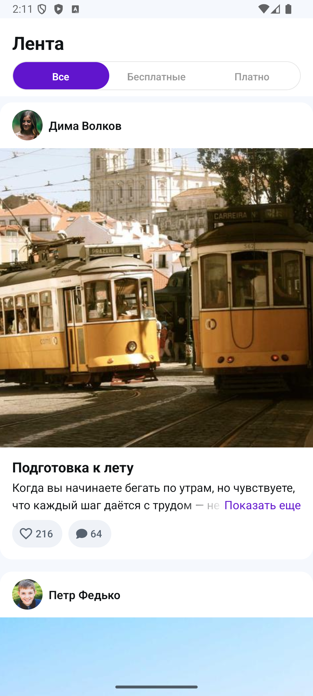
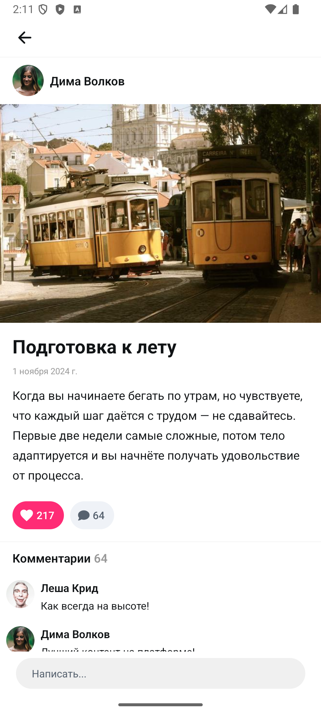

# Mecenate App

Feed screen for the Mecenate platform — a creator support service (Patreon/Boosty analog). Built with React Native + Expo.

## Features

- Paginated post feed with cursor-based infinite scroll
- Filter tabs (All / Free / Paid) — no loading flicker on switch (`keepPreviousData`)
- Pull-to-refresh
- Optimistic like toggling with MobX
- Post detail screen with inline comment thread
- Comments bottom drawer with real-time optimistic prepend
- Locked content overlay with native blur (`expo-blur` + dimezis on Android)
- Skeleton loading states
- Error state with retry
- Fixed-height comment input bar (consistent across all states)
- Design token system — colors, spacing, typography, radius

## Tech Stack

| Layer        | Library                                       |
| ------------ | --------------------------------------------- |
| Framework    | React Native + Expo SDK 54                    |
| Navigation   | Expo Router (file-based)                      |
| Server state | `@tanstack/react-query` v5                    |
| Client state | MobX + `mobx-react-lite`                      |
| Styling      | Design tokens (`src/shared/design/tokens.ts`) |
| Bottom sheet | `@gorhom/bottom-sheet`                        |
| Blur         | `expo-blur` (`dimezisBlurView` on Android)    |
| Language     | TypeScript (strict)                           |

## Getting Started

### Prerequisites

- Node.js 18+
- iOS Simulator / Android Emulator or physical device

### Install

```bash
npm install
```

### Run

```bash
npx expo start
```

Press:

- `i` — iOS Simulator
- `a` — Android Emulator
- Scan QR code with Expo Go (note: Android blur requires dev build)

### Android Dev Build (for native blur)

```bash
npx expo run:android
```

## Environment

No `.env` file required. API config is pre-set in `src/shared/api/client.ts`:

| Key        | Value                                  |
| ---------- | -------------------------------------- |
| Base URL   | `https://k8s.mectest.ru/test-app`      |
| Auth token | `550e8400-e29b-41d4-a716-446655440000` |

## Project Structure

```
src/
  features/feed/          # Feed feature (api, components, hooks, screens, store)
  shared/                 # Design tokens, UI primitives, API client, providers
app/                      # Expo Router routes
assets/icons/             # Custom SVG icon components
```

See [ARCHITECTURE.md](./ARCHITECTURE.md) for full structure, data flow, and conventions.

## Demo Preview

<p align="center">
  
</p>

### Android Screenshots

<p align="center">
  
  &nbsp;&nbsp;
  
</p>
